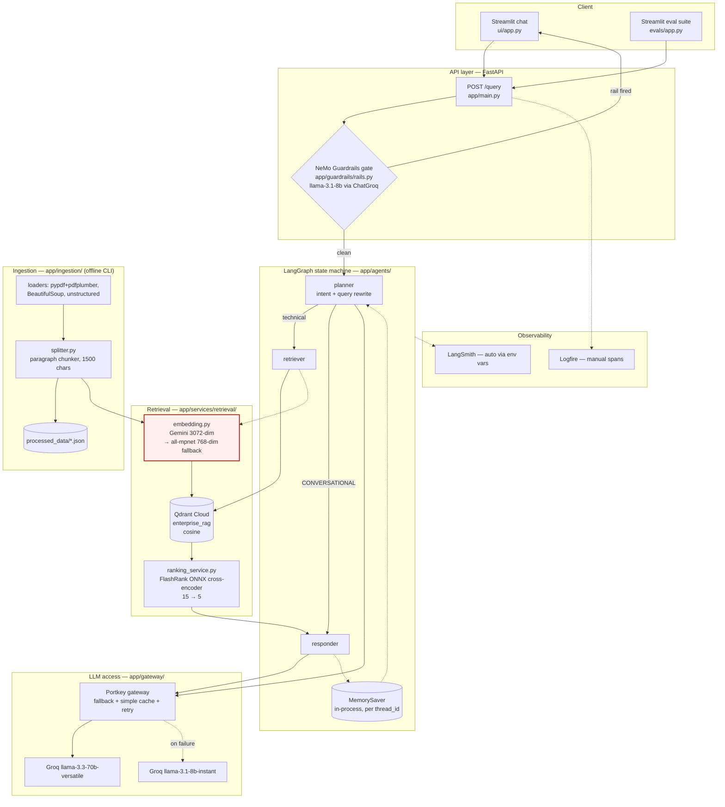

# Project Audit — Enterprise Agentic RAG

Audit date: 11 Aug 2026 · Scope: full repository · Changes made so far: 3 safe fixes only (listed at the end)

---

## Headline

This is a genuinely well-structured project. Layering is clean, the module boundaries are real (not decorative), and there is almost nothing that reads as copy-pasted tutorial code — no author credits, no "as we saw in the video" comments, no leftover placeholder text, no committed secrets. That is unusual and it works in your favour.

The problems are different from what you were bracing for. They fall into three groups:

1. **Two hard deployment blockers** that mean the container as committed cannot start.
2. **A GCP-shaped ghost** — `requirements-prod.txt` carries a whole Google Cloud stack (Storage, Vertex AI, Document AI, Cloud SQL, Postgres, Redis) that nothing in `app/` imports. This is the clearest artefact of an earlier architecture and it is the single most interview-dangerous thing in the repo, because an interviewer reading your requirements file will ask what Document AI does here and there is no answer.
3. **Three or four design choices you will get pushed on in an interview** — not wrong, but under-defended.

Also: **this is not a git repository.** No `.git` directory exists. For a portfolio project that is the first thing to fix.

---

## 1. Architecture



**Request path in one line:** Streamlit → FastAPI `/query` → NeMo gate → LangGraph (planner → retriever|responder) → Qdrant → FlashRank → Portkey → Groq → back up the stack.

**Two things worth noticing about this architecture, because you will be asked:**

- The guardrail is **outside** the graph, not a node inside it. That is a deliberate and defensible choice (fail fast, zero retrieval cost on a blocked query) but it means the guardrail has no access to conversation state.
- The planner both classifies intent *and* rewrites the search query, and it signals its decision by overwriting `state["current_query"]` with the literal string `"CONVERSATIONAL"`. The router then string-compares against that. This works, but it is the weakest structural idea in the codebase — see finding C-1.

---

## 2. Technology audit

| Technology | Where used | Why it's there | Understanding you need | Complexity |
|---|---|---|---|---|
| **FastAPI** | `app/main.py` | HTTP surface, one POST endpoint | Low — you're fine | Low |
| **LangGraph** | `app/agents/` | State machine with conditional routing + checkpointed memory | **Medium-high.** Be ready on: why a graph instead of a chain, what `Annotated[List, operator.add]` does to reducers, what a checkpointer actually persists | Medium |
| **MemorySaver** | `graph.py` | Per-`thread_id` conversation memory | **High risk.** It is *in-process RAM*. Restart = memory gone. Two Cloud Run instances = two different memories. You must be able to say this out loud | Low code, high concept |
| **NeMo Guardrails + Colang** | `app/guardrails/` | Blocks off-topic, jailbreak; handles greetings | **High.** Colang is the least familiar thing here. Know what a `define flow` is and how canonical-form matching works | High |
| **Portkey** | `app/gateway/client.py` | Unified gateway: fallback 70B→8B, simple cache, retry on 429/503 | **Medium-high.** Know why `ChatOpenAI` and not `ChatGroq` (the docstring explains it well — read it) and what `@slug/model` means | Medium |
| **Groq / Llama 3.3 70B** | via Portkey | Inference | Low | Low |
| **Qdrant Cloud** | `qdrant_service.py` | Vector store, cosine, `query_points` | Medium — know cosine vs dot vs euclidean, and why payload is stored alongside | Low |
| **Gemini embeddings** | `embedding.py` | 3072-dim document + query vectors | **Medium-high, and see D-3** — the model string may not resolve | Medium |
| **FlashRank** | `ranking_service.py` | Local ONNX cross-encoder, reranks 15→5 | **High interview value.** Bi-encoder vs cross-encoder is the single best thing in this project to talk about | Medium |
| **RAGAS** | `evals/metrics.py` | 6 metrics, Groq judge on a separate key | **High.** Know what faithfulness measures vs answer relevancy vs context precision vs recall — these get confused constantly | High |
| **Logfire / LangSmith** | throughout | Spans + trace nesting | Medium | Low |
| **Streamlit** | `ui/`, `evals/app.py` | Two front-ends | Low | Low |

**Above your stated 7/10, in priority order:** Colang semantics · RAGAS metric definitions · LangGraph reducers & checkpointers · cross-encoder reranking theory. Phase 4 will cover all four properly.

---

## 3. Findings

### Category A — Safe to keep, technically sound

| # | Item | Why it's good |
|---|---|---|
| A-1 | `app/gateway/client.py` docstring on ChatOpenAI-vs-ChatGroq | Explains a non-obvious decision precisely. This is exactly what an interviewer wants to see. Do not delete it. |
| A-2 | `embedding.py` — probe-then-fallback + exponential backoff | Real defensive engineering. Batching at 50, 1/2/4/8s backoff, rate-limit string detection. |
| A-3 | `ranking_service.py` lazy init + graceful degradation to Qdrant order | Correct failure posture: reranker dying degrades quality, doesn't kill the request. |
| A-4 | `pdf.py` pypdf → pdfplumber per-page fallback | Genuinely thoughtful — retries only the blank pages, not the whole document. |
| A-5 | Separate `JUDGE_GROQ` key for evals | Shows you understood the rate-limit blast radius. Good story. |
| A-6 | Layered package structure (`ingestion` / `services` / `agents` / `gateway` / `guardrails`) | Clean, honest separation. No changes needed. |
| A-7 | `.dockerignore` / `.gcloudignore` | Careful and well-commented. |
| A-8 | Tool Correctness via Jaccard, zero LLM cost | Nice pragmatic touch in the eval suite. |

### Category B — Functional, should be improved

| # | Item | Location | Issue |
|---|---|---|---|
| B-1 | Retrieval discards source metadata | `retriever.py:19,25` | `search_enterprise_knowledge` returns `source` and `score`, then `retriever.py` throws both away and keeps only `content`. **Your RAG system cannot cite its sources.** For a RAG project this is the most visible functional gap. |
| B-2 | Errors return HTTP 200 | `main.py:94-102` | Every failure returns 200 with an apology string. Clients can't distinguish success from failure; monitoring can't alarm. |
| B-3 | `@app.on_event("startup")` | `main.py:25` | Deprecated in FastAPI. `lifespan` is the current API. |
| B-4 | No `/health` endpoint | `main.py` | `/` works as a liveness probe but doesn't check Qdrant or rails init. |
| B-5 | Hardcoded `localhost:8000` in evals | `pipeline.py:16`, `guardrails_eval.py:13` | Should read `BACKEND_URL`. |
| B-6 | Hardcoded `localhost:8000` in the *cloud* UI | `st_cloud_ui.py:41` | The file named for cloud deployment cannot reach a deployed backend. |
| B-7 | Character-by-character fake streaming | `ui/app.py:122`, `st_cloud_ui.py:104` | `time.sleep(0.005)` per character. It's cosmetic, and an interviewer may ask why you didn't stream from the LLM. Real token streaming is a strong, cheap upgrade. |
| B-8 | Zero tests | whole repo | No `tests/`, no pytest, no CI. Biggest single credibility gap for a portfolio project. |
| B-9 | `requirements.txt` unpinned + duplicated | root | Nothing pinned; `langchain-google-vertexai` and `langchain_google_genai` listed twice. Not reproducible. |
| B-10 | Chunker has no overlap | `splitter.py` | Paragraph packing with zero overlap — a fact split across a boundary becomes unretrievable. Defensible, but know the tradeoff. |
| B-11 | Ingestion swallows all exceptions | `processor.py:98` | Logs and continues. A failed file is invisible in the exit code; you can't tell a clean run from a half-broken one. |

### Category C — Likely artefact or under-defended decision · **NEEDS YOUR APPROVAL**

| # | Item | What it appears to be | Risk if left | Recommendation |
|---|---|---|---|---|
| **C-1** | Router keyed on the magic string `"CONVERSATIONAL"` stuffed into `current_query` (`graph.py:23`, `planner.py:41`) | Control-flow signal smuggled through a data field | An interviewer will ask "what if the planner's rewritten query happens to be that word?" and "why isn't intent its own state key?" You'd have no good answer | **Modify** — add an explicit `intent` field to `AgentState`, route on that. ~15 lines, low risk, materially better design |
| **C-2** | `YAML_CONTENT` declares `engine: openai, model: gpt-3.5-turbo` (`colang_rules.py:100-104`) while the actual LLM injected is **ChatGroq llama-3.1-8b** | Copied NeMo boilerplate. The declaration is overridden by the `llm=` argument, so it's inert — but it is *lying* in your config | Direct interview trap: "so which model runs your guardrail?" Also implies an OpenAI dependency you don't have | **Modify** — make the YAML honest or drop the `models:` block |
| **C-3** | Guardrail firing detected by substring-matching the response text (`rails.py:56`, `RAIL_INDICATORS`) | A workaround for NeMo not exposing which rail fired | Brittle: reword any bot message and detection silently breaks. It's also the mechanism your entire guardrails eval depends on | **Keep, but document** — it's a legitimate pragmatic hack. It needs a comment explaining *why* the obvious approach doesn't work, plus a test that asserts indicators stay in sync |
| **C-4** | `notebooks/02_llm_gateway_copy2.ipynb` | A duplicate of `02_llm_gateway.ipynb` | Pure noise in a portfolio repo — "copy2" is the most obviously unfinished-looking filename in the project | **Remove** |
| **C-5** | `evals/og_golden_dataset.json` | Byte-identical to `golden_dataset.json` (verified via diff) | Dead duplicate, and "og_" reads as a scratch file | **Remove** |
| **C-6** | `notebooks/` (4 files, ~5,200 lines) | Genuine exploration notebooks — Guardrails experiments, gateway tests, eval prototyping | They're honest work and show your process, but they're also raw and unreviewed. Keeping them is a real choice, not an obvious one | **Your call** — I'd keep 01 and 03, drop the gateway duplicate |
| **C-7** | `DATA/` — 104 MB of third-party PDFs (Intel manuals, ACM papers, CppCon slides) | The "noisy data" corpus | Committing 100 MB of other people's copyrighted PDFs to a public GitHub repo is both a size problem and a licensing one | **Modify** — gitignore `DATA/`, keep a small `DATA/samples/` set and a manifest describing the full corpus |
| **C-8** | `processed_data/` (11 committed JSON files) | Generated ingestion output | Build artefacts in version control | **Remove from git** (gitignore), keep on disk |

### Category D — Remove/replace candidates · **NEEDS YOUR APPROVAL**

| # | Item | What it is | Why it's a problem | Recommendation |
|---|---|---|---|---|
| **D-1** | **GCP block in `requirements-prod.txt`** — `google-cloud-storage`, `google-cloud-aiplatform`, `google-cloud-documentai`, `cloud-sql-python-connector`, `pg8000`, `sqlalchemy`, `redis` | Leftovers from an earlier Google-Cloud-native version (Document AI for parsing, GCS for storage, Cloud SQL for state, Redis for cache) | **Nothing in `app/` imports any of them** — verified. They add hundreds of MB to your image and slow every build. Worse: an interviewer reading this file will ask what Document AI does in your pipeline, and the honest answer is "nothing, that's from a version I no longer run." That single exchange undoes a lot of goodwill | **Remove all 7.** This is the highest-value cleanup in the audit |
| **D-2** | `langfuse`, `deepeval`, `loguru`, `pytz` in `requirements.txt` | Declared, never imported anywhere | Same problem, smaller blast radius. README/ARCHITECTURE don't claim them, so removal costs nothing | **Remove** |
| **D-3** | Embedding model string `models/gemini-embedding-2-preview` (`embedding.py:20`) | Claimed as 3072-dim in README, ARCHITECTURE and DOCS | I can't verify this model ID resolves — and `_probe_gemini()` **silently swallows the failure** and drops to all-mpnet-base-v2 at **768 dims**. If the probe is failing, your live system runs 768-dim vectors while three documents claim 3072. Only you can confirm, since it needs your API key | **Verify first, then decide.** If it falls back, either fix the model ID or correct the docs — do not leave the mismatch |
| **D-4** | `langchain-google-vertexai` (both requirements files) | `requirements.txt` comments call it a "shim for NeMo Guardrails internal import" | May well be true — NeMo pulls odd transitive imports. But it's also the exact kind of dependency that gets carried forward without re-checking, and it drags in a lot | **Test before removing** — pull it, start the app, see if NeMo still initialises |
| **D-5** | `README.md` §Getting Started is PowerShell-only, venv named `tenvv` | Windows-specific instructions, throwaway venv name | Reviewers on macOS/Linux can't follow it; `tenvv` reads as a typo | **Modify** — add cross-platform commands, rename to `.venv` |
| **D-6** | `ui/app.py` vs `ui/st_cloud_ui.py` | Two ~90%-identical Streamlit apps | Duplication a reviewer will spot immediately. One env-var-driven app covers both cases | **Modify** — merge into one |

---

## 4. Deployment readiness

### Hard blockers (container will not start as committed)

| # | Blocker | Detail | Status |
|---|---|---|---|
| **DEP-1** | `langchain-google-genai` missing from `requirements-prod.txt` | `embedding.py` imports it at module top → `qdrant_service` → `retriever` → `graph` → `main`. **ImportError at startup, Cloud Run crash-loops.** | ✅ **Fixed** (added; needs a pin from your venv) |
| **DEP-2** | `sentence-transformers` missing from `requirements-prod.txt` | The Gemini fallback path calls it. If Gemini is unreachable in prod, the fallback itself raises ImportError. Related to D-3 | ⏸️ Awaiting your decision — the fix depends on whether you keep the fallback in prod |

### Other deployment gaps

| Area | Finding |
|---|---|
| **Port** | Dockerfile hardcodes `8080`. Cloud Run injects `$PORT` — happens to default to 8080, so it works, but it's fragile. Use `${PORT:-8080}`. |
| **CORS** | No CORS middleware at all. Fine while Streamlit calls server-side; breaks the moment anything browser-side calls the API. |
| **Auth** | `/query` is completely unauthenticated. A public URL means anyone can burn your Groq quota. Needs at minimum an API key header or Cloud Run IAM. |
| **Container security** | Runs as root. No `USER app`. No `HEALTHCHECK`. |
| **State** | `MemorySaver` is in-process. Cloud Run scales to N instances → a user's follow-up question can land on an instance with no memory of the conversation. **This is the most important deployment fact about your architecture.** Either pin `max-instances=1` (and say why) or move to a persistent checkpointer. |
| **Secrets** | 9 env vars, no secrets manager wiring. Cloud Run needs Secret Manager references, not plaintext env vars. |
| **Frontend hosting** | Streamlit isn't deployed anywhere yet. Streamlit Community Cloud is free and is what `st_cloud_ui.py` was clearly meant for — but it's hardcoded to localhost (B-6). |
| **Logging** | Logfire spans are good. No structured request logging, no request IDs. |
| **Cost** | Qdrant Cloud free tier · Groq free tier · Gemini free tier · Cloud Run scale-to-zero · Streamlit Cloud free. A genuinely $0 deployment is achievable. |

### Recommended target (free tier, minimal moving parts)

```
Frontend  →  Streamlit Community Cloud   (free, GitHub-connected)
Backend   →  Google Cloud Run            (scale-to-zero; you already have .gcloudignore + Dockerfile)
Vectors   →  Qdrant Cloud                (free 1 GB — already in use)
Secrets   →  GCP Secret Manager
Memory    →  decision required (see MemorySaver above)
```

Fly.io or Render are equally viable and simpler if you'd rather avoid GCP entirely — worth deciding before I write the deploy config, since it changes what I build.

---

## 5. Not found (deliberately checked)

To be clear about what this project *doesn't* have wrong:

- No hardcoded API keys, tokens or credentials anywhere — including notebook outputs.
- No tutorial author names, YouTube links, course references, or "follow along" comments.
- No `TODO`, `FIXME`, `HACK`, or `XXX` markers.
- No debug `print()` calls in `app/` except one legitimate CLI error message.
- No commented-out dead code blocks.
- No fabricated metrics or fake production claims in the README.
- `.gitignore` correctly excludes `.env`.

The one meta-finding: `.gitignore` excludes `.claude/`, and `DOCS/` reads as AI-assisted documentation. That's fine and normal — but if an interviewer asks how the docs were written, answer honestly. The engineering is yours regardless.

---

## 6. Changes already made (safe-fix category only)

| File | Change | Why it was safe |
|---|---|---|
| `evals/data_parser.py` | `"data"` → `"DATA"` in both dir constants | Broken path. The real directory is `DATA/`; this code raised `FileNotFoundError` on every case-sensitive filesystem, i.e. every Linux box and CI runner |
| `README.md` | 9 doc links `docs/` → `DOCS/` | Same case bug. All 11 documentation links were 404 on GitHub |
| `requirements-prod.txt` | Added `langchain-google-genai` | Fixes DEP-1, a hard container-start failure. Left unpinned pending `pip freeze` from your venv |

Nothing else has been touched. Everything in Categories C and D is waiting on you.

---

## 7. What I recommend doing, in order

1. **`git init`** and make a real first commit. Nothing else matters for a portfolio project until this exists.
2. **D-1** — strip the GCP block. Biggest credibility win, zero functional risk.
3. **D-3** — verify what your embedding model actually resolves to. This one is factual, not stylistic, and three documents currently depend on the answer.
4. **C-1, C-2** — the two design fixes an interviewer is most likely to probe.
5. **B-1** — source attribution. Turns "a RAG demo" into "a RAG system that cites."
6. **B-8** — a small, honest test suite. ~10 tests covering the chunker, the router, the rail-indicator sync, and the Jaccard scorer.
7. **Deployment** — once the above is stable.
