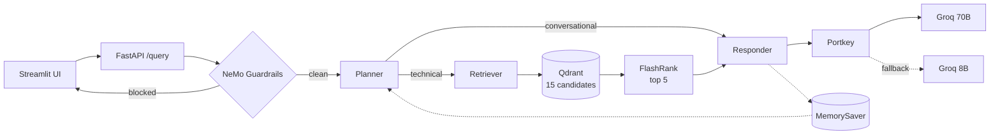

# Enterprise Agentic RAG

A retrieval-augmented question-answering system over technical documentation,
built as a LangGraph agent behind a guardrail gate, with a two-stage retrieval
pipeline and a RAGAS evaluation suite.

The corpus deliberately mixes relevant enterprise documentation with unrelated
technical material, so retrieval quality is measured against realistic noise
rather than against a clean index.

---

## What it does

Ask a question about Kubernetes, Intel hardware or enterprise networking. The
system:

1. **Screens the input** through NeMo Guardrails — off-topic questions,
   jailbreaks and prompt injections are refused before any retrieval happens, so
   a blocked query costs one small-model call and nothing else.
2. **Plans** — classifies the turn and, when documentation is needed, rewrites it
   into a standalone search query. Follow-ups like "and how do I scale it?" are
   resolved against the conversation history before anything is embedded.
   Greetings and history-answerable questions skip retrieval entirely.
3. **Retrieves in two stages** — 15 candidates by vector similarity from Qdrant,
   then a local cross-encoder reranks to the best 5.
4. **Answers with citations** — the responder sees each chunk labelled with its
   source file and is instructed to cite inline. If retrieval found nothing, it
   says so rather than answering from the model's own knowledge.

Every step is traced. Every answer carries the chunks and filenames it drew from.

---

## Architecture



Full diagrams in [ARCHITECTURE.md](ARCHITECTURE.md).

### Design decisions worth knowing about

**Guardrails sit outside the graph, not inside it as a node.** A blocked query
never touches the embedding API, the vector database or the large model. The
tradeoff is that the gate judges each message alone, with no conversation context.

**Two-stage retrieval.** Vector search compares a query embedding to document
embeddings computed at ingestion, before any query existed — fast and indexable,
but approximate. The cross-encoder reads query and passage together in a single
forward pass, so it scores real relevance, at the cost of one model inference per
candidate. Retrieving 15 and keeping 5 is the shape of that tradeoff.

**Conversation memory is in-process.** LangGraph's `MemorySaver` keyed by
`thread_id`, which is why the system needs no database. It also means memory does
not survive a restart and is not shared across instances — so the deployment is
pinned to a single instance. Swapping in `PostgresSaver` is a one-line change if
that constraint ever mattered. See [DEPLOYMENT.md](DEPLOYMENT.md).

**All LLM calls route through a gateway.** Portkey provides 70B→8B fallback,
response caching and retry-on-429 as configuration rather than hand-written
resilience code.

---

## Stack

| Layer | Choice | Why |
|---|---|---|
| API | FastAPI | async, typed request/response models, generated docs |
| Agent | LangGraph | conditional routing + checkpointed conversation state |
| Guardrails | NeMo Guardrails (Colang) | semantic intent matching, not keyword blocklists |
| Gateway | Portkey | fallback, caching, retries without bespoke code |
| LLM | Groq — Llama 3.3 70B / 3.1 8B | fast inference; 8B guards, 70B answers |
| Vectors | Qdrant Cloud | managed, payload filtering, free tier |
| Reranking | FlashRank | quantised ONNX cross-encoder, CPU, no API call |
| Embeddings | Gemini (3072-dim) | free tier, with a local 768-dim fallback |
| Parsing | pypdf + pdfplumber, BeautifulSoup, unstructured | all local, no OCR service |
| Tracing | Logfire + LangSmith | span nesting across nodes; per-step agent traces |
| Evaluation | RAGAS | faithfulness, relevancy, precision, recall, correctness |

---

## Running it

**Local mode needs one API key** — a free Groq key. Embedded Qdrant, local
embeddings and direct Groq calls stand in for the three managed services, so
there are no other accounts to create.

```bash
python -m venv .venv
source .venv/bin/activate          # Windows: .venv\Scripts\activate
pip install -r requirements.txt

cp .env.example .env               # set GROQ_API_KEY and LOCAL_MODE=true

python scripts/preflight.py                                  # validates config
python -m app.ingestion.processor DATA/true_data true --wipe # index the corpus
python scripts/demo.py                                       # API + UI, one command
```

Full walkthrough, including what to demo and what to do when it breaks:
[DEMO.md](DEMO.md).

**Cloud mode** — set `LOCAL_MODE=false` and fill in the Portkey, Qdrant Cloud and
Gemini sections of [.env.example](.env.example). Switching modes changes the
vector width (768 ↔ 3072), so re-index with `--wipe`.

**Running the pieces separately:**

```bash
uvicorn app.main:app --reload --port 8000    # API      → localhost:8000/docs
streamlit run ui/app.py                       # chat UI  → localhost:8501
streamlit run evals/app.py                    # evals    (needs the API running)
pytest                                        # 66 unit tests, no keys required
```

---

## Repository layout

```text
app/
  main.py              FastAPI — guardrail gate, /query, /health, /graph
  config.py            environment configuration
  agents/
    state.py           AgentState — typed intent, reducer on messages
    graph.py           node wiring, conditional routing, checkpointer
    nodes/             planner · retriever · responder
  gateway/             Portkey client + LangChain-compatible wrapper
  guardrails/          Colang definitions, rails lifecycle, firing detection
  ingestion/           loaders (PDF/HTML/DOCX/PPTX/TXT), chunker, indexing CLI
  services/retrieval/  embeddings, Qdrant search, cross-encoder reranking
evals/                 RAGAS suite, golden dataset, Streamlit dashboard
tests/                 unit tests over the deterministic parts
ui/app.py              Streamlit chat interface
DATA/                  corpus — true_data tracked, noisy_data excluded (see manifest)
DOCS/                  component deep-dives
```

---

## Documentation

| Document | Contents |
|---|---|
| [DEMO.md](DEMO.md) | local demo — one key, what to show, troubleshooting |
| [ARCHITECTURE.md](ARCHITECTURE.md) | full system diagrams |
| [DEPLOYMENT.md](DEPLOYMENT.md) | Cloud Run + Streamlit Cloud, secrets, known gaps |
| [INTERVIEW_GUIDE.md](INTERVIEW_GUIDE.md) | deep-dives on reranking, LangGraph, Colang, RAGAS, Portkey |
| [AUDIT_REPORT.md](AUDIT_REPORT.md) | code audit: findings, tradeoffs, what was changed and why |
| [DOCS/](DOCS/) | 11 component guides |

---

## Known limitations

Stated plainly rather than left to be discovered:

- **Single instance only** — conversation memory is in-process and lost on restart.
- **Chunking has no overlap** — a fact split across a paragraph boundary is harder
  to retrieve.
- **The guardrail sees one message at a time** — a jailbreak built across several
  turns would not be caught.
- **Rail firing is detected by substring-matching the response**, because NeMo
  exposes no structured signal for it. A test enforces that the indicators stay in
  sync with the rail definitions.
- **The eval set is 15 samples and 6 guardrail cases** — a smoke test, not a
  benchmark.
- **Auth is a single shared API key** — no per-user identity or revocation.

---

## Attribution

The initial version of this project was built by following a tutorial on agentic
RAG systems. It has since been substantially reworked: routing was restructured
around explicit typed intent, source attribution was added end-to-end, error
handling and the HTTP contract were rebuilt, the unused Google Cloud dependency
stack was removed, and unit tests, CI and deployment configuration were added.
[AUDIT_REPORT.md](AUDIT_REPORT.md) documents what changed and why.
